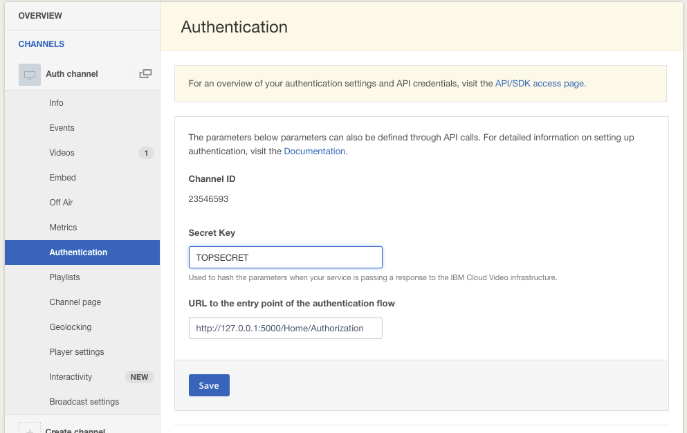
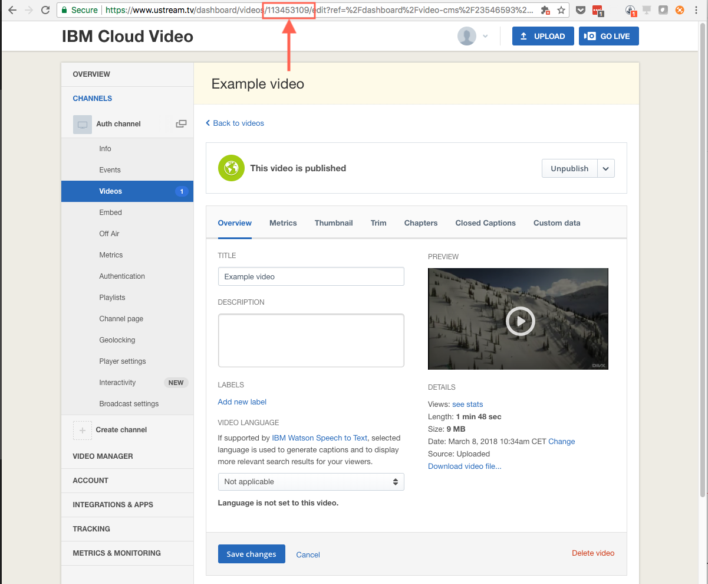

# IBM Cloud Video Viewer Authentication Setup Demo

## Requirements
* An [IBM Cloud Video Streaming Manager for Enterprise with Authentication API account](https://www.ustream.tv/product/align-secure-streaming-video) *(You can request a Trial account [here](https://www.ustream.tv/enterprise-video/contact-internal-communications))*
* Install [PHP 5.6+](http://php.net/downloads.php)

## Installation
1. **Set up channel authentication** for your channel(s) on Channels/Authentication dashboard
   * Secret Key: **Some random string**, this secret key is used for signing and validating authorization data
   * URL for the entry point of the authentication flow: **http://127.0.0.1:8000/auth.php** This is the end point where you can authorize your users to the content and then generate the signed hash data.
   
2. **Set Secret Key** in [auth.php](auth.php)
```
    ...
        $secret     = 'TOPSECRET';
    ...
```
3. **Set a video id** in [index.html](index.html) which will be used in this example. (This video needs to be on the same channel that was set up in Step 2.)
```
    ...
        <iframe src="http://www.ustream.tv/embed/recorded/114661532?html5ui" style="border: 0 none transparent;"  webkitallowfullscreen allowfullscreen frameborder="no" width="480" height="270"></iframe>
    ...
```


4. **Run demo** on localhost
```
php -S 127.0.0.1:8000
```

5. **Open demo** in your browser: http://127.0.0.1:8000/index.html (Recommended to use incognito mode)

# Resources
[IBM Cloud Video Viewer Authentication API](http://developers.ustream.tv/channel-api/viewer-authentication-api.html)